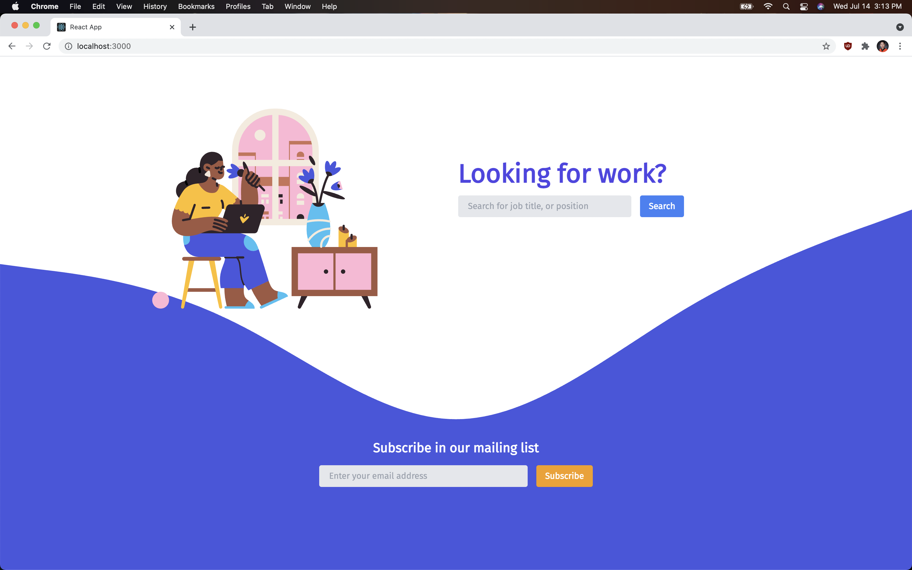
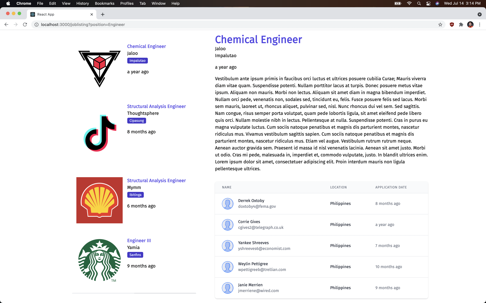

<p align="center">
    <h3 align="center">Job Listing Webapp</h3>

  <p align="center">
    A submission for a technical exam
    <br />
    <a href="#"><strong>Explore the docs »</strong></a>
    <br />
    <br />
    <a href="https://github.com/kristianespina/quick-job-board">Report Bug</a>
    ·
    <a href="https://github.com/kristianespina/quick-job-board">Request Feature</a>
  </p>
</p>

## Screenshots

### Homepage



### Listing Page



## Getting Started

### Installation

```bash
# for the back-end
# at root project directory
cd backend
npm install # or yarn install
```

```bash
# for the front-end
# at root project directory
cd frontend
npm install # or yarn install
```

### Running the servers

To run the server on the backend, simply run the following command on `backend` folder

```bash
# at ./backend folder
npm start
```

To run the server on the backend, simply run the following command on `frontend` folder

```bash
# at ./frontend folder
npm start
```
